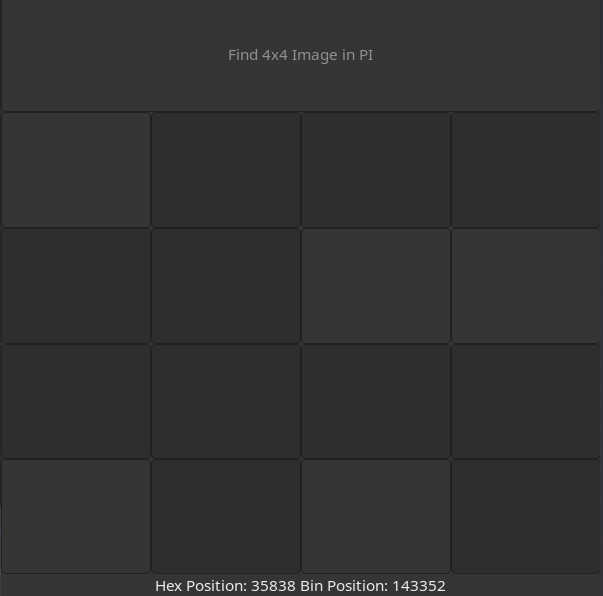

# PI Binary Expansion Finder

## Description
This project was inspired by *Matt Parker ([Stand-up Maths](https://www.youtube.com/@standupmaths) on YouTube)*, in which he searches the binary expansion of PI to find certain images.  
The project was written in plain **C**, using basic standard library support.  
It uses **GTK4** to create a simple *grid-based layout* that allows users to draw a 4x4 image and displays its position in the binary approximation of PI.  
For context, this project was tested with a PI text file that was in **Hexadecimal** and went up to **One Billion Digits**.

## Prerequisites
- C Compiler
- GTK4
- Hexadecimal PI file

## Installation
1. Clone the repository:

&nbsp;&nbsp;&nbsp;&nbsp;&nbsp;&nbsp;`git clone https://github.com/QuinnJohnsonCode/pi-binary-expansion-finder.git`

&nbsp;&nbsp;&nbsp;&nbsp;&nbsp;&nbsp;`cd pi-binary-expansion-finder`

2. Include the PI file:

&nbsp;&nbsp;&nbsp;&nbsp;&nbsp;&nbsp;Once a Hexadecimal PI file has been sourced, name it **pi-billion.txt** and put it in the root directory.  
&nbsp;&nbsp;&nbsp;&nbsp;&nbsp;&nbsp;(Or change the name in *binary-find-pi.c*)

3. Compile and run:

&nbsp;&nbsp;&nbsp;&nbsp;&nbsp;&nbsp;`gcc $(pkg-config --cflags gtk4) -o pi-gui.out pi-gui.c binary-find-pi.c $(pkg-config --libs gtk4)`

&nbsp;&nbsp;&nbsp;&nbsp;&nbsp;&nbsp;`./pi-gui.out`

## Usage
To use this GUI, follow these steps:

1. Click the buttons in the center to toggle their state.
2. Create an image by toggling the state of the buttons.
3. When ready, click the button that states "*Find 4x4 Image in PI*".
4. You can then view the Hex/Binary positions shown at the bottom.

## Preview

## Contact
PI Binary Expansion Finder was created by Quinn Johnson.

Reach out to me at my [Email](mailto:Quinn.Johnson99@gmail.com).
